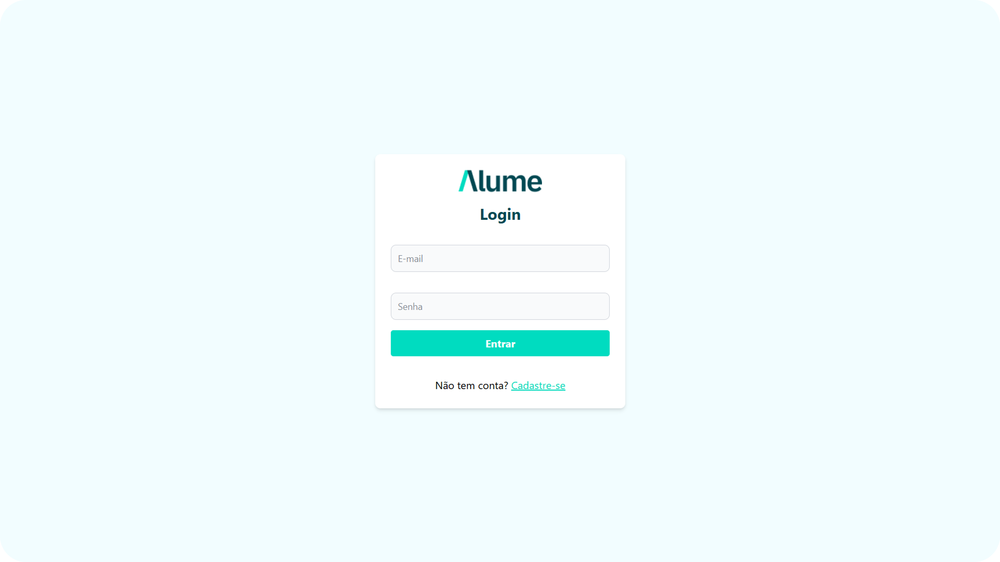
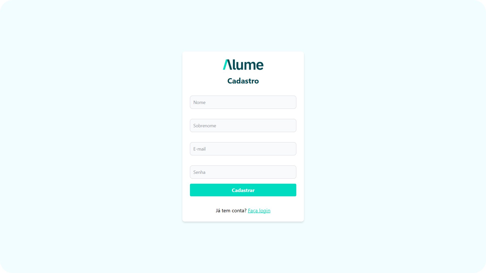
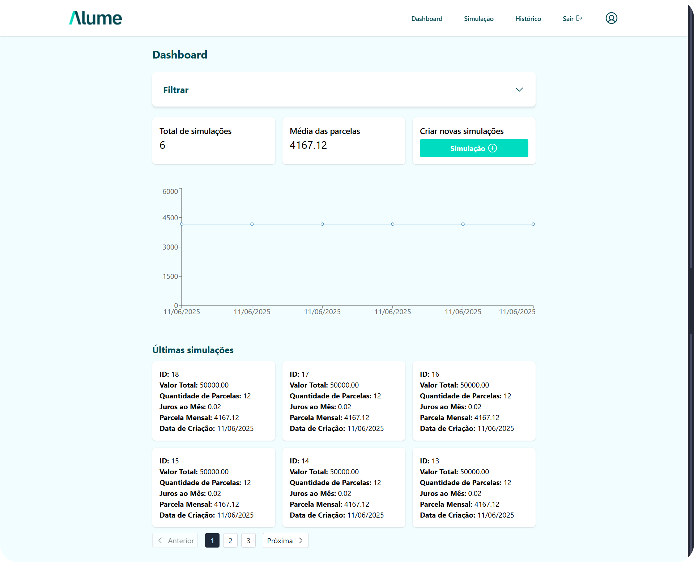
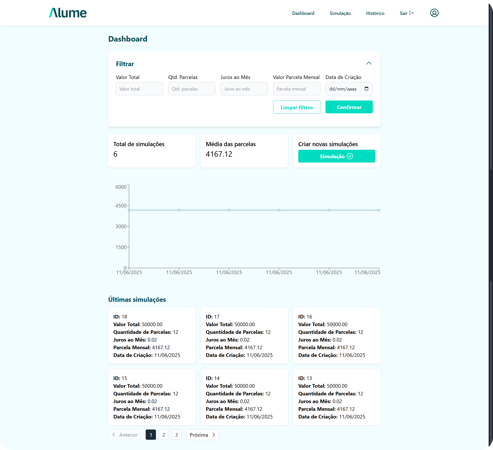
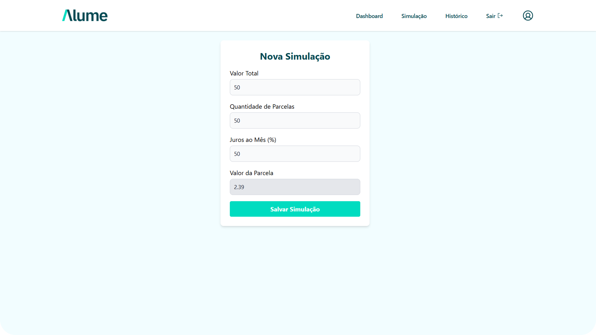
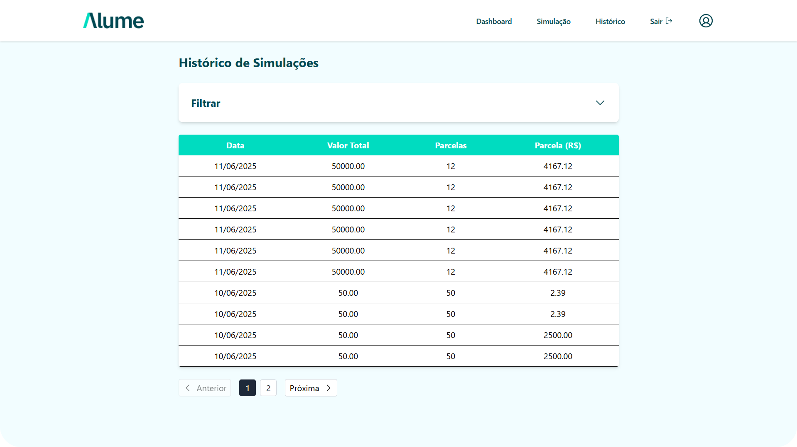

# Simulação de Financiamento Estudantil

Este projeto é o frontend de um desafio fullstack, desenvolvido com React, TypeScript e Vite.

## Pré-requisitos

- Node.js (versão recomendada: 22.x)
- npm ou yarn

## Telas Disponíveis

- **Login:** Autenticação de usuários.  
  _Path:_ `/login` ou `*`

  

- **Cadastro:** Registro de novos usuários.  
  _Path:_ `/register`

  

- **Dashboard:** Visão geral após login.  
  _Path:_ `/app`

  

- **Dashboard (Filtros abertos):**  
  _Path:_ `/app` (com filtros abertos)

  

- **Simulação:** Tela para simulações específicas do desafio.  
  _Path:_ `/app/simulation`

  

- **Histórico:** Consulta de ações/simulações anteriores.  
  _Path:_ `/app/history`

  

## Bibliotecas Utilizadas

- **React**: Biblioteca principal para construção da interface.
- **TypeScript**: Tipagem estática para JavaScript.
- **Vite**: Ferramenta de build e desenvolvimento rápido.
- **React Router DOM**: Gerenciamento de rotas.
- **Redux / React-Redux / @reduxjs/toolkit**: Gerenciamento de estado global.
- **@phosphor-icons/react**: Ícones para a interface.
- **@hookform/resolvers**: Integração de validação com React Hook Form.
- **zod-i18n-map**: Internacionalização de mensagens de validação.
- **react-hot-toast**: Notificações toast.
- **TailwindCSS**: Estilização utilitária.
- **ESLint**: Linting e padronização de código.
- **PostCSS / Autoprefixer**: Processamento de CSS.

## Configuração de Variáveis de Ambiente

1. Copie o arquivo `.env.example` para `.env` na raiz do projeto:
   ```
   cp .env.example .env
   ```
2. Edite o arquivo `.env` conforme necessário, ajustando a variável `VITE_BACKEND_URL` para apontar para a URL da API backend desejada.

Exemplo de conteúdo:
```
VITE_BACKEND_URL="http://localhost:3333/api"
```

## Scripts

- `dev`: Inicia o servidor de desenvolvimento com Vite.  
  Acesse o projeto em `http://localhost:5173` (ou porta configurada).
- `build`: Compila o projeto para produção, gerando os arquivos otimizados na pasta `dist`.  
  Executa o TypeScript (`tsc -b`) antes do build do Vite.
- `lint`: Executa o ESLint em todos os arquivos do projeto para verificar e padronizar o código.
- `preview`: Executa um servidor local para visualizar a build de produção gerada na pasta `dist`.

---

## Como Executar o Projeto

### 1. Instale as dependências

```bash
npm install
```

### 2. Configure as variáveis de ambiente

Copie o arquivo `.env.example` para `.env` e ajuste conforme necessário:

```bash
cp .env.example .env
```

### 3. Inicie o servidor de desenvolvimento

```bash
npm run dev
```

Acesse o projeto em `http://localhost:5173`.

### 4. Build de produção

Para gerar a build de produção:

```bash
npm run build
```

### 5. Visualizar a build de produção localmente

```bash
npm run preview
```

